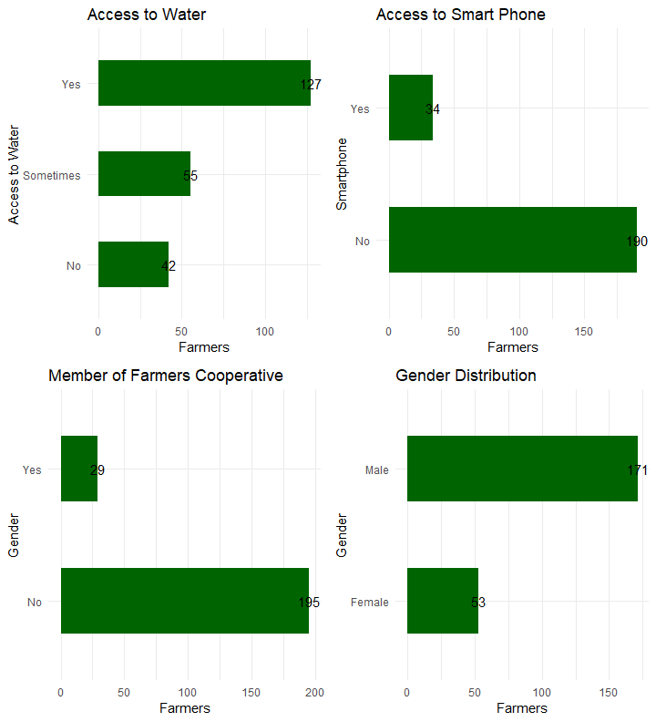
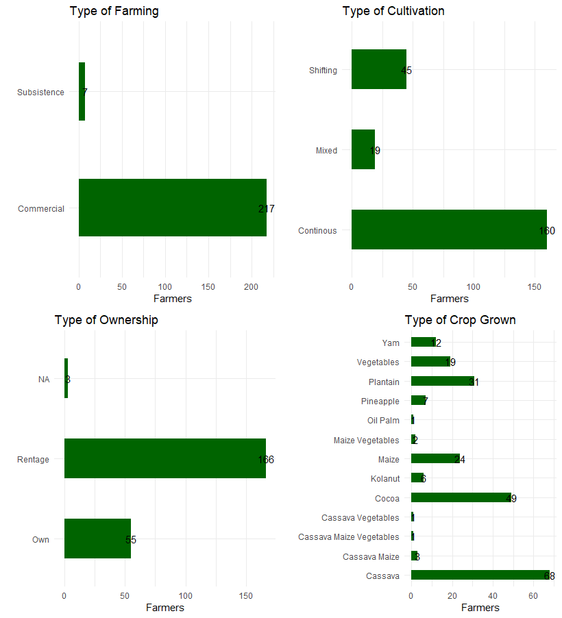
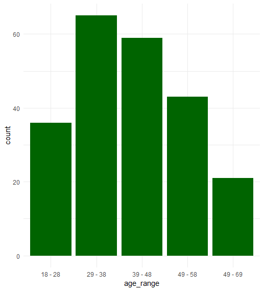

## Farm-sense project

**Food security** has become an issue of global concern in recent times. Nowadays, food security is being transformed by data, especially open data. Open data - data that anyone can be use, re-use and redistribute - is shaping solutions to enable more efficient and effective decision making at multiple levels across the agricultural value chain, fostering innovation via new services and applications, and driving organizational change through transparency. A wide range of data is needed by a variety of agricultural actors to meet different needs; to empower farmers, optimise agricultural practice, stimulate rural finance, facilitate the agricultural value chain, enforce policy and promote government transparency and efficiency. Through the adoption of open data in agriculture, farmers can benefit through improved communication and data driven decision in the application of fertilizers, planting and harvesting. Furthermore, researchers can use it to access crucial agricultural related information, and policy makers can use it to for evidence-based investment.

Ondo State is one of the foremost states in agriculture in Nigeria. The state is positioned and blessed with an opportunity to grow exportable products due to balanced seasons, arable lands and an interested government. However, there is a lack of access to open data that will help to improve the policy decisions that shape food systems and everything that depends on them. This data, when used well, serves to ensure and improve efficiency along the entire food value chain.

This project seeks to develop a platform that will be a repository for farmer’s data which will be analysed and visualized regularly. The platform can then be used as a recommendation tool to aid decision making, project the activities of farmers, and tell their stories.

# Goals and Objectives
**Goal**:

The goal of this project was to establish a web platform that provides access to open data and information on farms and farmers’ activities in Akure (North / South) and Ifedore LGAs of Ondo State.

**Objectives**:

- Increase access of the government and other agricultural stakeholders to open data on farms and farmers information in Akure (North / South) and Okitipupa LGAs of Ondo State.
- Reduce frustration in accessing data on farms and farmers in Akure by the government and agricultural stakeholders for planning and decision making purposes.
- Improve access to standardized educational resources for student, innovators, and youths who have little or no knowledge of agriculture and farming.
- Improve the quality of road data and point of interest (POI) to help facilitate decision making.

# Results and Analysis

*plot 1: Gender,Cooperative,Smartphone, and Access to water*

In plot 1, out of the 221 farmers, only 52 of the farmers are female. This shows a progressive increase of gender diversity in Agriculture. Only 29 of the total farmers are part of any society or cooperation. The larger population believes that farmers’ cooperative societies are a huge waste of time and very expensive as their needs or complains are not heard or changes made to them. We also found that a large population of the farmers do not have access to storage facilities, which expose their product to farm disease. While for the ones that own storage facilities, such facilities are not up to standard. We also, wanted to understand how technology can be of help to these farmer. But, we realized that 188 of the 221 farmers do not have access to a smartphone. That means, any solution that would be provided for smallholders farmer will be offline driven.

*plot 2: Farms ownership, crop grown, cultivation and type of farming*

In plot 2, 214 smallholder farmers of 221 are commercial farmers. That is, they farm with the intention to sell and make a living from the product sold. More so, 80% of these smallholder farmer undergo continuous farming with majority of the farmland on rental and lease. Will also mention the fact that these smallholder farmer engage in labour intensive farming and don’t have access to mechanized tool to farm.

*plot 3, age range distribution*

plot 3, shows the age distribution of farmers. 157 farmers are between the age of 18 and 48. This shows that youth are getting to understand the role they play in agricultural and food for the nation.
